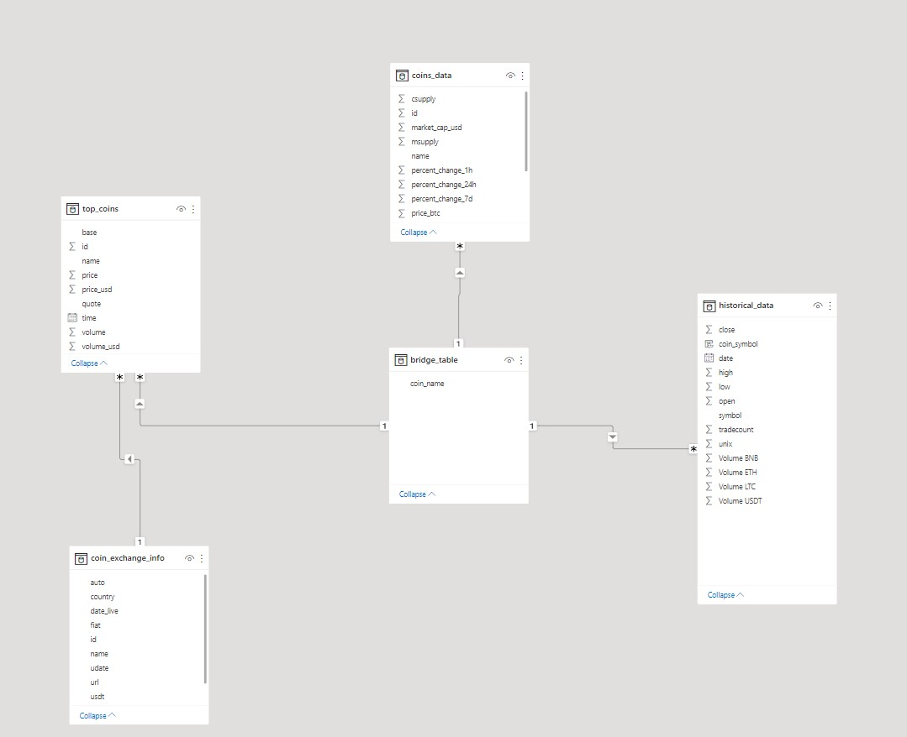
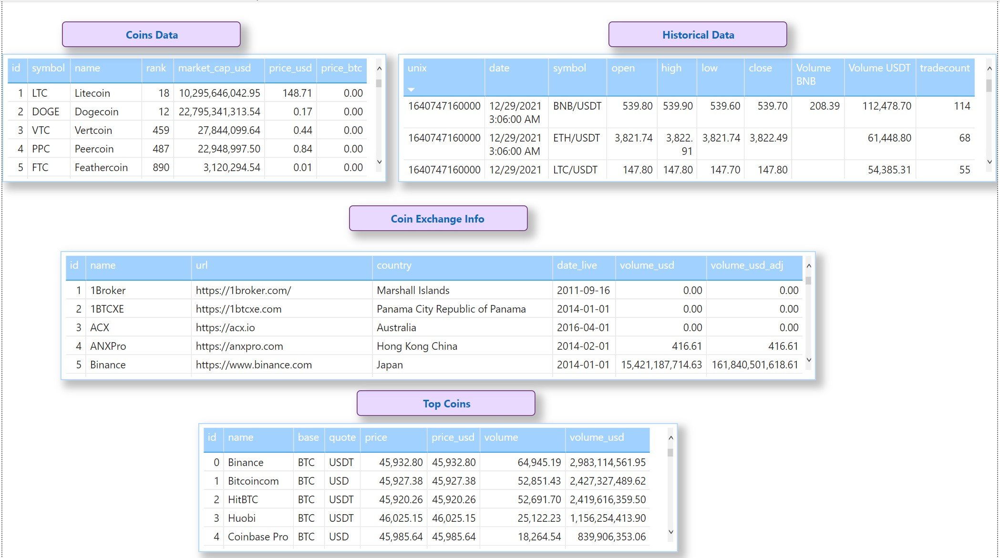
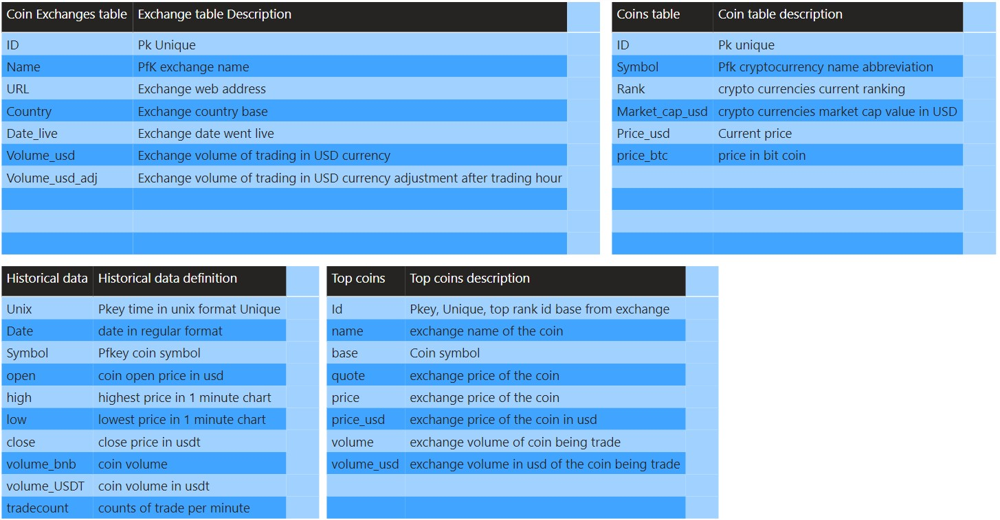

                                # coinlore_api_project
## **.README**
### **Project Overview**

      As part of Data-Engineer Udacity-CapStone project to apply concept learn within the course such as AWS services, relational database systems, and scheduling services. With the current popularity crypto-currencie. To help user keeping up to date of new coins being created and different exchanges services. I created an data pipeline from coinlore api service and hosted it on AWS services including dataware house storage system.Coinlore is an open public API that let user request for cryptocurrencies and exchanges information. This project current lack many feature in supporting real-time situation data. Intergrating features such as data migration tools to keeping track of different versions and migration control. Furthermore, the project can also leverages of scheduling services to refresh the database with the new data inserted. If the current project requires larger space and higher compute power, we can use HDFS on top of Redshift cluster and process the data with spark.

<h1>
Data Model
</h1>

                                    Star Schema: Simple and best for readbility and implementation of future changes.
      This model have multiple dimensional tables and one fact table to help analytic team determine the cryptocurrencie's data, along with historical data in minute. This data best update once per day because it will capture 1 minutes data of market for each cryptocurrencies within the fact table.

<h1>
Data Example
</h1>
 

 
<h1>
Data Definition
</h1>

## **How To Use:**

                  Requirement: AWS KEY and AWS SECRET KEY Access
- Download historical_data_temp.csv and set into data DIR.

   1. clone repo
   2. create virtual environment 
   3. pip install all dependencies within `requirements.txt`
   4. run start_redshift.py

            Output aws role and redshift cluster credentials into local .env file
   5. run main.py
   6. run db_main.py

            Use Output from start_redshift.py to connect into Redshift cluster 
   7. run stop_redshift.py (close cluster)

## **Pipeline Steps**
- Build ETL pipeline from coinlore open API of cryptopcurrencies

         Perform Get data request from coinlore public API for cryptocurrencies and exchange data
- Transform requested data into CSV format and manipulate the data with pyspark, pandas, and SQL
- Stores the requested data into S3 bucket as temperorary file's storage
- Create a pipeline to transfer CSV file format into RedShift serves as dataware
- Stages data into Redshift AWS as staging table
- Use staging tables to create database as relational Star Schema concept

#### **Tool Used Reasons:**
- *Python*
 For data processing, manipulation and scripting
      
      Python libaries:
            Pandas: Manipulate data and handle low memory execution.
            Pyspark: Manipulate data and handle large data set execution tasks.
            dotenv: Environment variable load into script to prevent exposure of sensitive credential access keys.
            boto3: AWS python CLI interface to execute tasks such as start and stop redshift cluster and transfering data into S3 bucket.
            requests: request data from coinlore API page 

- *Power bi*
  Create visualization and data modeling 
- *Jupyter Notebook*
  Text editor to run python code
- *Postgres sql*
  Local database on to test SQL DML before loading to Redshift.
- *AWS S3*
  File storage system use to store data files before storing into redshift. Local storage hard drive have limitation and difficult to share with other developer, S3 buckets with key access provided by admin.
- *AWS Redshift*
  Redshift storage over postgres because it is cost effective dataware house, suitable for analytical team to perform analytic. It is BI tools friendly and allows parrallel processing through mutliple clusters.

## **Data Information**

**Coins data: s3://tien-duong1151/data/coins_data.csv**
- Retreived from coinlore API, consisted of coin symbols, full name, rank, market cap and price in USD

**Exchange data: s3://tien-duong1151/data/coin_exchange_info.csv**
- Retreived from coinlore API, information on exchanges of cryptocurrencies broker. Consisted of exchange full name, URL, country exchange base at, and date exchange went live

**Top coins: s3://ten-duong1151/data/top_coins.csv**
- Retreived from coinlore API, use rank base on `exchange data` and request as user's desire number of top coins to be returned. Consisted of coin full name, ability to trade with, price, and volume

**Historical data: s3://tien-duong1151/data/final_historical_data.csv**
- Large dataset retrieved from `https://www.cryptodatadownload.com/`. Under Binance cryptocurrencies broker. Consited of historical data of ETH, BTC and LTC by minutes along with tradecount, volume, and price.

## **Data Re-scaling scenarios**:
1. *If the data was increased by 100x*?

 If the data was 100x we can use ELB for load balancing across multiple clusters or EC2 instnace. ELB support SSL termination and sticky sessions, it also conduct health check and upgrade on instances bases on receives oncoming traffic.

  

2. *if pipeline would need to be run on daily basis by 7am everyday?*

 We can use Apache Airflow or CRON to schedule the pipeline job to run everyday at 7am.

 

3. *The database needed to be accessed by 100+ people at same time?*

 Currently the project data storage is held within Redshift. Currently Redshift limited at 500 connections and 50 concurrency per cluster.

 

## **Current Project Files:**
 
 1. notebook.ipynb  ==> Combination of scripts along with output and data model schema structure.
 
 2. start_redshift.py ==> Using Pyhton boto3 to create AWS redshift, IAM role, and Port connection. Will check until Cluster OPEN

 3. stop_redshift.py ==> Stop Redshift Cluster script, will check until cluster CLOSE

 4. database DIR --
        -- create_table_sql.py  ==> contain SQL queries to DROP, CREATE, INSERT data into S3 and Redshift
        -- db_main.py ==> pipeline script to run SQL queries

 5. main.py ==> Pipeline for data cleaning, and export into S3

 6. requirements.txt ==> libraries installed require for the project

 7. config.py   ==> configuration variable references from .env which NOT included along with repo

 8. spark_functions.py ==>   Functions in pysaprk to import and transform data

 9. pandas_functions.py ==> Function in pandas to import, transform and export data

 10. data_schema.pbix    ==> visualization of datasets along with table schema

 References:
 
      https://www.cryptodatadownload.com/
 
      https://www.coinlore.com/cryptocurrency-data-api